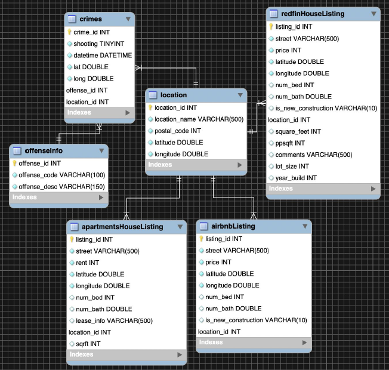
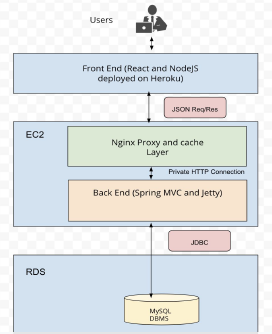
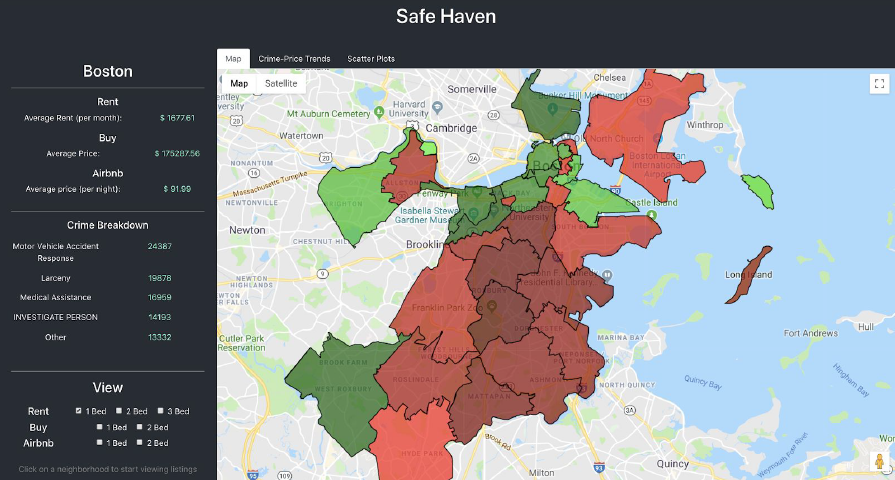
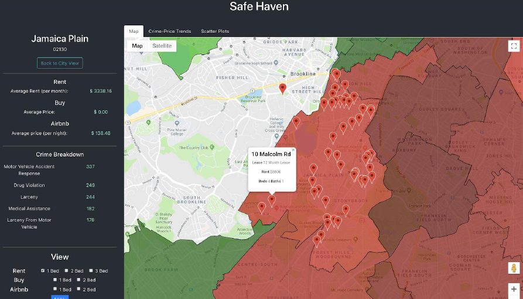

# SafeHaven

**WRITTEN**: June 2019

**CONTRIBUTORS**:
- *Front-End*: Anubhuti Vyas (vyas.an@husky.neu.edu), Ram Arivu Chelvan (arivuchelvan.r@husky.neu.edu)
- *Back-End*: Vivin Wilson (wilson.v@husky.neu.edu), Matthew O'Brien (obrien.matt@husky.neu.edu)
- *Database*: Adam Sousie (sousie.a@husky.neu.edu)

**LANGUAGE(S)**:
- *Front-End*: JavaScript (React.js/Node.js), Google Maps API (Deployed on [Heroku](https://www.heroku.com/))
- *Back-End*: Java (Java Servlet, SpringMVC, JDBC), MySQL (Deployed on [AWS EC2](https://aws.amazon.com/ec2/))
- *Database*: MySQL (Deployed on [AWS RDS](https://aws.amazon.com/rds/))

**CLASS**: CS5200 - Database Management Systems
    
**RESOURCES**:

- Boston Crime Data: [Kaggle](https://www.kaggle.com/AnalyzeBoston/crimes-in-boston)
- [Redfin](https://www.redfin.com/) Apartments Data: web scraping in python
- [Apartments.com](https://www.apartments.com/) Data: web scraping in python
- AirBnB Data: [InsideAirbnb](http://insideairbnb.com/)
- [Google Maps Documentation](https://developers.google.com/maps/documentation/)
- [Google Maps with React Tutorial](https://engineering.universe.com/building-a-google-map-in-react-b103b4ee97f1)
- [HTTP in Python](https://2.python-requests.org/en/master/)

## README Table of Contents
1) [Running the Program](#Running-the-Program)
2) [Project Summary](#Project-Summary)
3) [Data Aquisition Process](#Data-Acquisition-Processes)
4) [Database Design](#Database-Design)
5) [User Interface](#User-Interface)
6) [Contributions Breakdown](#Contributions-Breakdown)

## Running the Program

Origially accessible at http://safehaven-data.herokuapp.com/, but our Google API keys have since expired. See below for screenshots.

## Project Summary

Our goal was to create a web-based application with a simple map-based user-interface that would map both crime and
housing data to help a user find an appropriate place to stay in Boston. We planned to provide the user with elementary
data analysis based on location in order to inform a decision, but focused largely on making the crime data easily understood
and the housing data readily available in our interface. As of project submission, we have successfully accomplished these
broad goals. Our interface is straightforward and avoids complexity and ambiguity; our data is visualized simply using
color-coding and map pins on the Google Maps API; and our data analysis consists of a Top 5 Crime Codes table as well
as graphs which illustrate the correlation between housing prices and crime rates across Boston.

## Data Acquisition Processes
- **Redfin.com** and **Apartments.com** :
    1. We observed outgoing requests from the browser using Chrome developer tools and replicated the requests to
    API servers using Python.
    2. JSON and Requests libraries were then used to assemble requests and parse responses.
    3. Using empirical analysis, we determined the requisite input parameters. We referenced Google Maps to
    determine required longitude and latitude information.
    4. The output of these API calls was then formatted into a CSV.
    5. The data was cleaned up and formatted using Python to prepare it for insertion into the database.
- **Crime** :
    1. All crime data is provided by the Boston Police Department (BPD) and compiled and posted on Kaggle.com by
    Analyze Boston, the city’s official data hub. Data is from June 14, 2015 to September 3, 2018 and includes
    information from all calls received by BPD (not exclusively criminal calls; e.g. medical and suspicious activity).
    2. We downloaded the crime.csv file and used a custom MySQL Create script to build a database table containing
    the information we considered to be most relevant. Entries which did not contain location data or had null crime
    code information were not included in our database. Crime classification information in the incident table was
    normalized by extracting it into its own table in the database.
- **AirBnB** :
    1. We downloaded the Airbnb dataset for Boston from InsideAirbnb. This dataset contained individual CSV files
    for both listings and listing availability.
    2. The listings.csv file contained over fifty columns, so it was important to extract only relevant columns and remove
    everything else. This process was done manually in Microsoft Excel.
    3. The data was normalized by extracting only the fields that were dependent on the listing and useful for our
    application like price per night, superhost?, location details, rating, etc. A custom MySQL Create script was used
    to generate the table and the data was subsequently imported as a CSV into our MySQL database.
    
## Database Design

Our database uses four datasets (crime, AirBnB listings, apartment listings from Redfin, and apartments.com) to
help the user find an appropriate place to live. To enhance data compatibility between the crime and AirBnB/apartment
data, crime latitude/longitude coordinates are mapped to a zip code and stored in a location table referenced by the four
datasets as a foreign key. The housing datasets already contained zip codes, so they were simply converted to correspond
to location_ids as foreign keys. The location table holds a location_id primary key, location_name (e.g. “North End”),
unique zip code, and a latitude/longitude coordinate for the center of the area. Crime incidents reference a crime code
foriegn key, which is linked to a short description (offense_code) and a more specific description (offense_desc) in the
crime_code table.

    

## System Architecture

SafeHaven is a Spring MVC application with embedded Tomcat server which acts as the application server. The
application interacts with a MySQL database using JDBC.
- **Front End** (Visualization Layer): Responsible for visualization of data based on inputs from the user. Interactive
and non-blocking UI built with React to allow quick rendering of information and asynchronous background
requests.
- **Nginx Layer** : Intelligently caches responses to frequent incoming requests, permitting unmodified responses to
be served from cache instead of being recomputed by the backend server. Handles CORS issues by adding
required headers and responding to preflight (OPTIONS) requests on behalf of the backend server.
- **Back End** (Business Logic Layer) : API layer written in Java using Spring MVC framework. Uses JDBC
connection to talk to the Database layer. Provides API endpoints to allow the Visualization layer to access data.
- **Database Layer** : MySQL Relational Database, for managing data.

    

## User Interface

We used React to build our UI. Google Maps API was integrated to allow users to interact with different
neighborhoods across Boston and see relevant insights about that neighborhood (with the help of online tutorials). We
used Google Charts to display different graphs that illustrate the price variation in different neighborhoods with respect to
crime rates.
- The application allows the user to:
    - View the average property prices across Boston (to lease and/or buy).
    - View the five most common crimes across Boston, with incident counts.
    - Filter housing results using number of bedrooms.
    - Visualize the housing listings and crime distribution on a map interface, with color-coding indicating relative
    crime levels compared to the average. The darkest red color shows the area with the highest crime rate and the
    lightest green shows the area with the lowest crime rate.
    - View graphical analysis of crime counts vs. housing prices using curve charts and scatter plots.
    - Click on “Back to City View” button at any time to go back to the default map view.

    

- When users select a neighborhood on the map, the application:
    - Shows the different listings (lease, buy, airbnb) as markers in the neighborhood. The user can click on the marker
    to see the details like address, rent, price per night, the price to buy, number of beds and baths for a particular
    listing.
    - Allows the users to filter the type of listings they want to see by checking the appropriate check boxes on the left
    side bar.
    - Displays the average property prices from apartments.com and Redfin with Airbnb rates for the selected
    neighborhood.
    - Enables the user to compare individual listing prices with the average listing price in a given neighborhood.
    - Provides the following insights for the selected neighborhood on the left-hand sidebar:
        - Average lease price (per month)
        - Average purchase price
        - Average AirBnb price (per night)
        - General crime breakdown (crime type and count)
        

    

    
## Contributions Breakdown
- **Vivin** : Back-end scaffolding code and all endpoints dealing with housing data. Set up Nginx server to handle
CORS and caching. Deployed back-end code on AWS EC2. Wrote Python scripts to scrape and clean data from
redfin.com and apartments.com. Slide for application architecture for Project Presentation. Application
Architecture for Final Report.
- **Matthew** : All endpoints dealing with crime data. Data normalization and MySQL Create scripts for crime data.
Initial framework for Status Report, Final Report, and presentation. ER Diagram for database. Project Vision and
Establishing Database slides for presentation. Database Design section for Status and Final Reports. Abstract and
Conclusions for Final Report. Proofreading for all written submissions and presentation.
- **Anubhuti** : Data normalization and scripts to create table for data from redfin.com and apartments.com. Services
in React to get data from Back-end. Integrated Google Charts API for creating curve graphs and scatter plots to
analyze the relation between crime and housing prices and created graph components in the application to display
graphs. Colored the graph indicating relative crime levels in different neighborhoods relative to the average crime
rate across Boston. Demo in Project Presentation. User Interface section for Final Report.
- **Ram** : Data extraction, normalization and MySQL create scripts for Airbnb data. Set up and configured the React
project and its deployment on Heroku. Introduced Redux to manage state in the React application. Integrated
Google Maps API in the application and created basic components in the application. Identified Use Cases for
the presentation. User Interface section for Final Report.
- **Adam** : Built MySQL database and deployed on AWS. Configured user permissions and access privileges.
Uploaded all data to database. Outlined process for Establishing Database slide for presentation. Set up Google
Drive folder for document sharing.

    
### Copyright

Copyright 2019 Matthew O'Brien (obrien.matt@husky.neu.edu) et al. All rights reserved.
