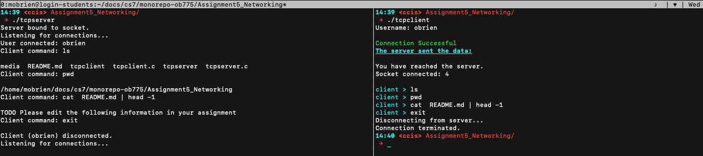

# TCP Server/Client

**WRITTEN**: April 2019


**CONTRIBUTORS**: Matthew O'Brien (obrien.matt@husky.neu.edu)


**LANGUAGE(S)**: C


**CLASS**: CS5007 - Computer Systems


**RESOURCES**:
  - https://www.kernel.org/doc/man-pages/

## Running the Program

To compile the program, while in the project directory:
```bash
$ make
```
To run the program (best done with a server running in one terminal window, and one or more clients running in other windows):
- Server window:
```bash
$ ./tcpserver
```
- Client window(s):
```bash
$ ./tcpclient
```

**NOTE ON COMPATIBILITY** : Designed to run on Northeastern University servers; issues may arise on other machines.

## Project Summary

For this project we were tasked to create a server and client pair which would be able to interact with each other over a TCP connection. The client would be able to connect to the server, run terminal commands (cd, ls, ps, etc), and close the connection when prompted by the user. The server would manage all connection requests, but only accept one incoming connection at a time.



## Copyright

Copyright 2019 Matthew O'Brien (obrien.matt@husky.neu.edu). All rights reserved.
