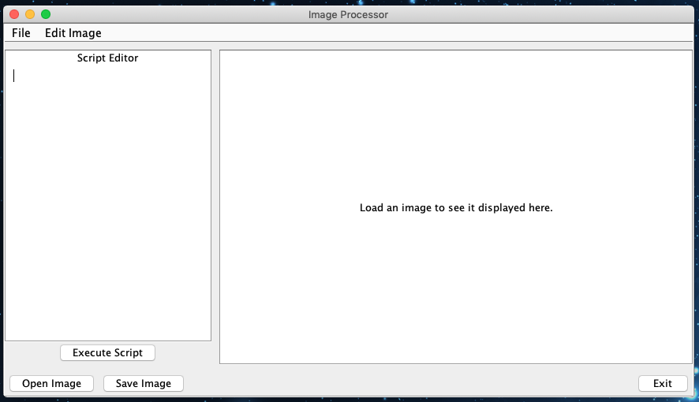
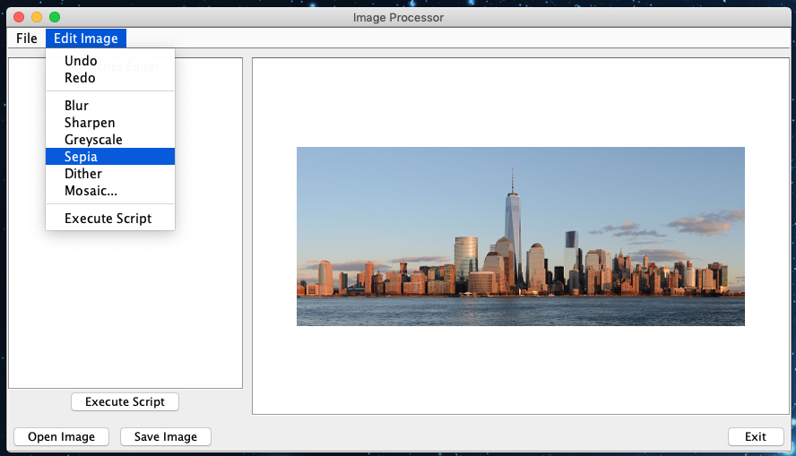
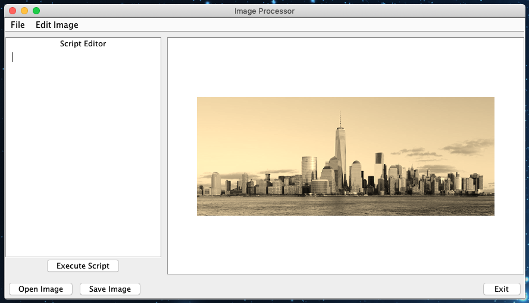
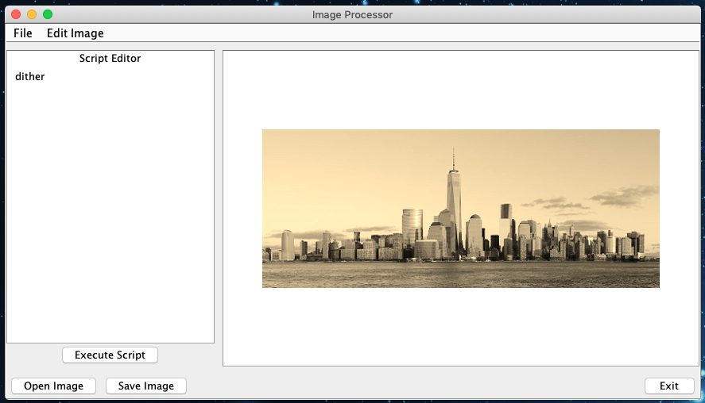
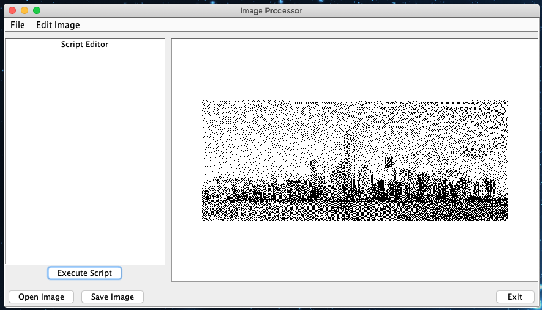
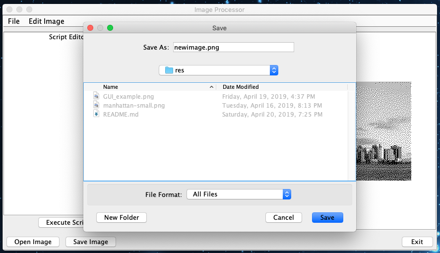

# Image Processing Application

**WRITTEN**: April 2019

**CONTRIBUTORS**: Matthew O'Brien (obrien.matt@husky.neu.edu), Brian Rouse (brian.g.rouse@gmail.com)

**LANGUAGE(S)**: Java

**CLASS**: CS5004 - Object-Oriented Design

**RESOURCES**:

- https://course.ccs.neu.edu/cs5004/index.html

## README Table of Contents
1. [Project Summary](#Project-Summary)
2. [Program Structure](#Program-Structure)
3. [How to Use the Program](#How-to-Use-the-Program)
4. [Screenshots/Demo](#Screenshots)
5. [Assignment Sections Completed](#Assignment-Sections-Completed)
6. [Images Used](#Images-Used)
7. [Changelogs](#Changelogs)

## Project Summary
Brian and I programmed an application for processing images in a variety of ways. The user could interact with it over the command line or a Java Swing GUI we created. The application supported a variety of filters and enabled the user to view their changes on the GUI. The application could load and save images from a user-specified directory and run scripts written and uploaded by the user. See below for more information about program functionality.

## Program Structure

The program controller is instantiated by passing a model and a view to its constructor. Thus, the 
controller has access to the functionality included in the model and the view. In script mode, the 
controller takes in user input, parses the first argument, and passes the rest of the arguments to 
the appropriate function.  The view is not used in this mode, so the controller takes in a version 
of the view that does not do anything. In interactive mode, the user performs operations via a GUI 
interface, and the controller ensures that those operations are carried out. Our program validates 
user input when user input is needed; i.e. each method that requires some user input is responsible 
for validating that user input. This structure helps with the modularity of the code, as methods can 
easily be added without needing to change much of the overhead code.

The model is categorized into two packages, utilities and image, with the ImageProcessor class 
overseeing the execution of commands received from the controller. The image package handles 
the storage format of images, basic data operations (such as getHeight), and validation of pixel 
data. The utilities package executes requested operations upon image objects (or otherwise generates 
them by reading them into the program). The FilterUtil class applies specified transformations upon 
an Image object, and returns new Image objects reflecting the requested changes. All methods in 
FilterUtil are private except for FilterDispatch(), which is called by ImageProcessor and told what 
operations are requested. FilterDispatch() then delegates the task to one of the class's private 
methods before returning the result. Methods such as applyKernel() and applyMatrix() are generalized 
to support any kernel or matrix operations added to the class in the future (although matrices must 
be 3x3, kernels can be larger or smaller).

We made these design decisions in order to make our code as organized and modular as possible. We 
sought to make our own lives easier (as well as those of anyone who may be reading our code) by 
delegating tasks reasonably and keeping the code as general as possible, when possible.

## How To Use The Program

**NOTE ON COMPATIBILITY** : Designed to run on Northeastern University servers; issues may arise on other machines.

### Interactive GUI Mode

The program is stored as a JAR file, and can be run from the command line with the following:
```bash
$ java -jar assignment10.jar -interactive
```

Once the GUI interface opens, all operations can be run from the menu at the top of the screen, and 
some operations like loading and saving can also be run with onscreen buttons.  Scripts can be typed 
and run from this mode using the box on the left of the screen.  See the Script Mode documentation 
below for usage.

### Script Mode

The program is stored as a JAR file and can be run from the command line with the following:
```bash
$ java -jar assignment10.jar -script scriptName.txt
```

The scriptName.txt can be the name of any script file, including the relative or absolute path. For 
example, a script file from the res folder can be run with:
```bash
$ java -jar assignment10.jar -script res/scriptName.txt 
```
    
Scripts can have any number of extra spaces, tabs, and lines, but each executable command must be 
on a single line with its own arguments, and commands will be run in order from top to bottom. 
A second command on the same line will not be run. Available script commands are listed below.

* Generate a checkerboard of certain size:
```
checkerboard size
```

* Generate a VIBGYOR rainbow, with user-specified stripe orientation (horizontal or vertical) 
and canvas size:
```
rainbow orientation width height
```    

* Load an image into the program:
```
load path/filename.png    
```

* Save an image into the program:
```
save path/filename.jpeg
```

* Blur an image:
```
blur
```

* Sharpen an image:
```
sharpen
```

* Get the greyscale version of an image:
```
greyscale
```

* Get the sepia version of an image:
```
sepia
```

* Get the dithered version of an image:
```
dither
```

* Get the mosaic version of an image using a user-specified number of seed pixels:
```
mosaic seednum
```

* End program execution:
```
exit
```


## Screenshots

See below for a progression of screenshots demonstrating program functionality.

### 1. Initial window:

<p align="center">
    
</p>


### 2. Menu options:

<p align="center">
    
</p>


### 3. After applying "sepia":

<p align="center">
    
</p>


### 4. Before running the script:

<p align="center">
    
</p>


### 5. After running the script:

<p align="center">
    
</p>


### 6. Saving an image:

<p align="center">
    
</p>


## Assignment Sections Completed

The model, view, controller, and driver, as specified in the HW8, HW9, and HW10 requirements. An 
executable JAR file is included, as well as automated tests for the controller. The view is not 
tested directly, but every command callback method that is linked to the GUI interface does have 
tests. We did not write tests for the model, given that the results are best observed by humans, but 
the model's responses to illegal arguments are indirectly tested in our controller tests.

The image mosaic option was included in the last submission and is still included here. We have also 
included undo and redo operations.

## Images Used

*manhattan-small.png aka testImage.png* - taken from course website at 
https://course.ccs.neu.edu/cs5004/assignment8.html

*bananas.png* - we own this image and are authorizing it for use in the project. This image was 
submitted to meet hw8 and hw9 requirements, but is not required for this submission.

*GUI_example.png* - we own this image and are authorizing it for use in the project.

## Changelogs

### Changelog 04/19/19

* added a view that provides an interactive GUI mode, per the homework spec.
* modified Driver.main to let users specify -script or -interactive mode when launching.
* modified controller to implement a Features interface, to be used by the view for command 
    callbacks.
* updated how filters are passed through the program. Filter enum is now part of the 
    controller instead of the model.  All three MVC components use the enum now, instead of 
    passing around strings.
* added file extension validation to the load and save methods called in script mode, and updated 
    the tests to check for this.
* added overwrite checks to let the user know if a load/generate operation will result in losing 
    the currently stored image, and confirm they want to continue.
* added undo/redo functionality using two deques; by default, the maximum number of possible 
    undos is capped at 15. Redos are only possible while the previous operation is an undo (i.e. 
    a redo cannot be successfully executed if the previous operation is a blur). Deques are 
    capped to reduce total memory usage. Additionally, if called after a script is executed,
    undo() will handle its operation as if the instructions were implemented via button clicks
    in the GUI; there is no lost functionality when using with a script. Undo/redo functionality 
    is only accessible via the GUI (cannot be used on CLI).

### Changelog 04/10/19

* added a controller which handles top-level user commands and calls the appropriate method 
    in its model to handle the user's request. Only the first argument of each script line 
    (the command) is validated by the controller, and then the model's methods validate all 
    arguments. This increases the modular nature of the code. See more below.
    * in addition to txt files, the controller can take any Readable object (StringReaders, stdin, 
    etc.) to facilitate testing and future additions.
* modified Driver.main() to support loading in a .txt script to the controller via a command line 
    argument. The controller will then execute the commands therein (if they are valid).
    * main() will throw an IOException if an input file is not convertible to a Readable, or if the 
    specified file is not a .txt file or does not exist.
    * demo scripts have been included in res/scripts/. To call them, the appropriate program
    argument syntax would be scripts/script1.txt (for example, assuming running the .jar from 
    the command line in the res/ directory).
* restructured how input is handled and validated:
    * the model method that is handling a user's command is now entirely responsible for validating 
    the command's argument input (with no burden on the controller). The controller only extracts 
    individual lines from input and confirms that each line corresponds to a valid command.
    * as a result of this restructuring, method signatures have changed. Instead of model methods
    taking in an int or boolean, for example, they will take in a list of arguments and then parse
    the values it requires from that list.
    * overall, this design makes our program more modular, as a new method can be added to the model 
    with virtually no changes to the controller. The division of exception-handling responsibilities 
    is also much clearer now. 
* added a controller.Filter enum for the model, which lists all possible image editing operations 
    available. The controller can confirm if an inputted filter command is valid by calling the 
    model's isValidFilter method, which compares input strings to the enum. This way, new image 
    processing methods can be added to the model without any edits made to the controller.
* added method to FilterUtil that will dither an image.
    * added a case to the switch statement in FilterUtil method filterDispatch() to support 
    calls to the new method.
* added method to mosaic() an image based on a user-specified number of seed pixels.
    * created a new util class, ClusteredPixel, that keeps track of a given pixel's location
    in the image and color channels. Used exclusively in the mosaic() method.
    * added a case to the switch statement in FilterUtil method filterDispatch() to support 
    calls to the new method.
* moved the image file I/O methods (loading and saving) from the model to the controller, to better 
    conform to the MVC pattern.
    * The model's interface now includes methods to receive pixel data from the controller 
    (and validate that data), as well as methods to pass edited data back to the controller for I/O 
    purposes.

