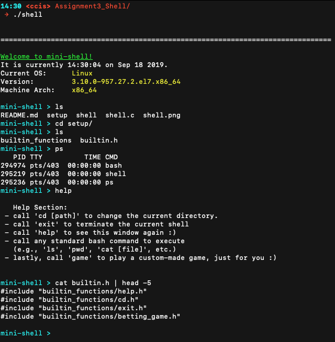
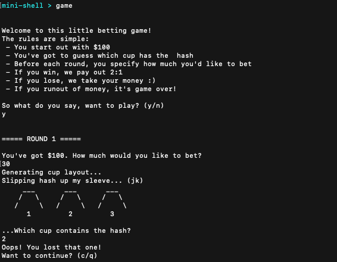

# Mini-Shell

**WRITTEN**: March 2019

**CONTRIBUTORS**: Matthew O'Brien (obrien.matt@husky.neu.edu)

**LANGUAGE(S)**: C

**CLASS**: CS5007 - Computer Systems
    
**RESOURCES**:

- http://man7.org/linux/man-pages/

## Running the Program

To compile the code, while in the project directory:
```bash
$ make
```
To run the program:
```bash
$ ./shell
```

**NOTE ON COMPATIBILITY** : Designed to run on Northeastern University servers; issues may arise on other machines.

## Project Summary

When compiled and executed in a terminal, the program activates a "mini-shell" that is capable of executing various commands specified by the user, including four custom-built functions. See below for more details.



**FEATURES**:

- A signal-handler implementation (Ctrl-C kills the shell and all child processes)
- A welcome message to the user displaying current user, date/time, OS, version, and machine architecture
- A custom command prompt which forks and executes commands input by the user
- Support for one pipe operation per user entry
- Basic error handling for unknown commands
- Four built-in functions, stored and accesed via function pointers:
    - exit : quits the mini-shell, ending all child processes
    - cd : enables the user to change the current working directory
    - help : prints out general guidance for the mini-shell
    - game : a mini-game resembling a three-cup-shuffle (see below for more details)

## Betting Game README



**SYNOPSIS**:

A betting game based on 'cup shuffling'.

**DESCRIPTION**:

The user starts out with $100. Each round, the program randomly chooses which 'cup' to place the 'hash' under. If the user guesses correctly, they win as much as they bet. If they lose, the lose everything they bet. After each round, the program checks to see if the user still has some money before asking if they would like to play again. If they do not have any money, or do not want to play again, the game prints out some information regarding their performance and closes, returning control back to the shell.

**NOTES**:

I divvied up the functionality of the game into a few different functions; there is a host function that oversees the whole process, a game loop function, a drawing function (prints out the cups) and a small function to explain the rules to the user upon starting. I loaded it into minishell the same way I loaded the other built-in programs (cd, exit, help): by adding them to the builtin.h header file (which is loaded by minishell).

### Copyright

Copyright 2019 Matthew O'Brien (obrien.matt@husky.neu.edu). All rights reserved.
